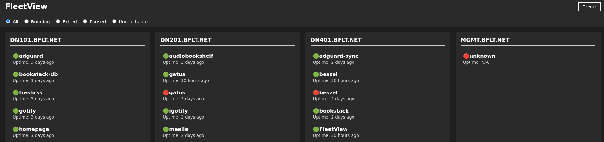

# fleetview
Visualize container workload distribution between docker (swarm, standalone) nodes

Features:
- Show docker containers for each node specified
- Show uptime
- Support standalone Docker
- Support Docker swarm
  

ToDo:
- Default to dark mode
- Add Uptime for each Node
- Add CPU and memory utilization for each Node
- ??? 
